# Autonomous Software Project Manager — Project Report

> A presentation-ready report generated from the actual source code. Read this top‑to‑bottom and you will be able to present every part of the system confidently.

---

## 1. Introduction

The **Autonomous Software Project Manager** is an AI-driven web application that turns a single plain‑English project idea (e.g. *"a food delivery app"*) into a complete, structured software‑planning package. It does this by running the idea through a **pipeline of five specialised AI agents**, each acting like a member of a real software team — a Requirement Analyst, a Business Analyst, a Database Architect, a Project Planner, and a Risk Analyst. Results stream back to the browser **live**, one agent at a time, and are finally assembled into a single downloadable Markdown report.

It is built as a **Java Spring Boot** backend (the agent engine) plus a **React** frontend (the live dashboard), powered by **Google Gemini** through the LangChain4j library.

---

## 2. Objective

- Convert an unstructured project idea into structured, professional planning artifacts **without human analysts**.
- Coordinate multiple AI agents so each builds on the previous agent's output (a real pipeline, not five isolated prompts).
- **Stream progress in real time** so the user watches each agent finish.
- Stay **resilient**: a failed or hallucinating agent must never crash the system or produce garbage.
- Demonstrate **clean architecture** through the disciplined use of **10 classic design patterns**.

---

## 3. Requirements

### 3.1 Functional Requirements
1. Accept a free‑text project idea from the user.
2. Run 5 agents in a fixed order: **Requirement → Business → Database → Planner → Risk**.
3. Requirement Analyst: extract core features, user roles, constraints, assumptions, NFRs.
4. Business Analyst: produce user stories, epics, business goals + **real market research** (Tavily web search).
5. Database Architect: produce normalised tables, relationships, and a **Mermaid ERD**.
6. Project Planner: produce a **Work Breakdown Structure** (phases → tasks) and a **Mermaid Gantt** chart.
7. Risk Analyst: produce evidence‑backed risk factors with impact × probability scoring.
8. Stream each completed agent to the UI via **Server‑Sent Events (SSE)**.
9. Assemble a final Markdown report and allow copy / download.
10. Persist every run to **PostgreSQL** and allow reloading a past run by ID.

### 3.2 Non‑Functional Requirements
- **Real‑time / responsiveness:** results appear per‑agent, not after a long wait (SSE, 5‑min timeout).
- **Resilience:** the pipeline *never throws*; failures degrade to `PARTIAL_COMPLETE` / `FAILED`.
- **Cost / token efficiency:** SHA‑256 response caching + per‑agent token budgets + input stripping.
- **Availability:** automatic **multi‑API‑key rotation** with exponential backoff on 429/503.
- **Anti‑hallucination:** market/risk claims must be backed by real search evidence or left empty.
- **Maintainability / extensibility:** swappable LLM provider and swappable task execution via interfaces.
- **Security:** all secrets externalised to a gitignored `.env`; no keys in tracked files.

---

## 4. Project Features

- 🧠 **5-agent autonomous pipeline** — each agent has a distinct persona and JSON output schema.
- 🌐 **Live web research** — Business & Risk agents call the **Tavily Search API** for real evidence.
- 📊 **Auto-generated diagrams** — ERD and Gantt charts are generated **in Java** and rendered as **Mermaid** in the browser.
- ⚡ **Real-time streaming UI** — agents light up one-by-one as they complete (SSE).
- ♻️ **Resilience & Null-Object safety** — a bad agent halts gracefully instead of crashing.
- 💸 **Token-management layer** — response caching, input stripping, per-agent output budgets.
- 🔁 **Multi-key rotation** — cycles through several Gemini keys to dodge rate limits.
- ✅ **Human-in-the-loop review gate** — "Approve & Finalize" / "Discard & Restart" before locking the package.
- 💾 **Persistence & replay** — every run is saved to PostgreSQL and reloadable by ID.

---

## 5. Behavioral Representation

### 5.1 Use Case Diagram

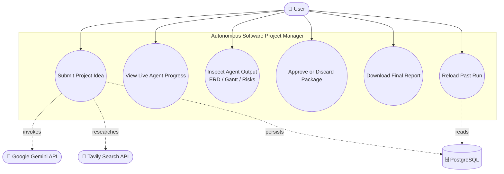

### 5.2 Activity Diagram (Pipeline Flow)

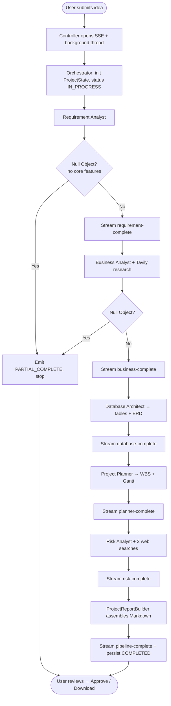

---

## 6. Project Outcome

- A working end-to-end system that converts one sentence into a **5-section professional planning package**: requirements, business analysis, database design (ERD), project plan (Gantt/WBS), and risk assessment.
- A **single Markdown report** the user can copy or download as `.md`.
- A **real-time dashboard** that visualises the AI "team" working.
- A demonstrably **fault-tolerant** pipeline (verified during E2E runs: it correctly degraded to `PARTIAL_COMPLETE` when Gemini's free tier returned 503 at the 4th/5th agent — the system stayed up and streamed partial results).
- A codebase that is a **clean reference implementation of 10 GoF design patterns** in a real, non-toy context.

---

## 7. Tools & Technologies

| Layer | Technology |
|---|---|
| **Language (backend)** | Java 21 |
| **Backend framework** | Spring Boot 3.5.0 (Web, Data JPA, Validation) |
| **AI integration** | LangChain4j 1.0.0‑beta3 (`langchain4j-google-ai-gemini`) |
| **LLM** | Google Gemini (`gemini-2.5-flash`, AI Studio) |
| **Web research** | Tavily Search API |
| **Database** | PostgreSQL (JPA / Hibernate) |
| **Streaming** | Server‑Sent Events (`SseEmitter`) |
| **Boilerplate** | Lombok |
| **Build** | Maven (`mvnw` wrapper) |
| **Language (frontend)** | JavaScript (React 18) |
| **Frontend build** | Vite 5 |
| **Styling** | Tailwind CSS 3.4 + PostCSS + Autoprefixer |
| **HTTP / streaming** | native `fetch` + `ReadableStream` (SSE), axios 1.6 (history GET) |
| **Diagrams** | Mermaid 11 (lazy‑loaded, client‑side render) |
| **Secrets** | `.env` (gitignored) → injected as `${ENV_VAR}` in `application.properties` |

---

## 8. Design Patterns

This project **deliberately implements 10 design patterns** (plus a Decorator). For each: where it lives, **why it was needed**, and a concise class diagram.

### 8.1 Singleton
**Where:** the Gemini chat model beans + `CachingAiService`, all created once by the Spring container (`LangChain4jConfig`).
**Need:** an LLM client holds connection pools and API keys — creating one per request would waste resources and scatter key management. One shared, thread‑safe instance manages all model access. *(Spec called this `GeminiConnectionManager`; in the real code Spring's container guarantees the single instance.)*

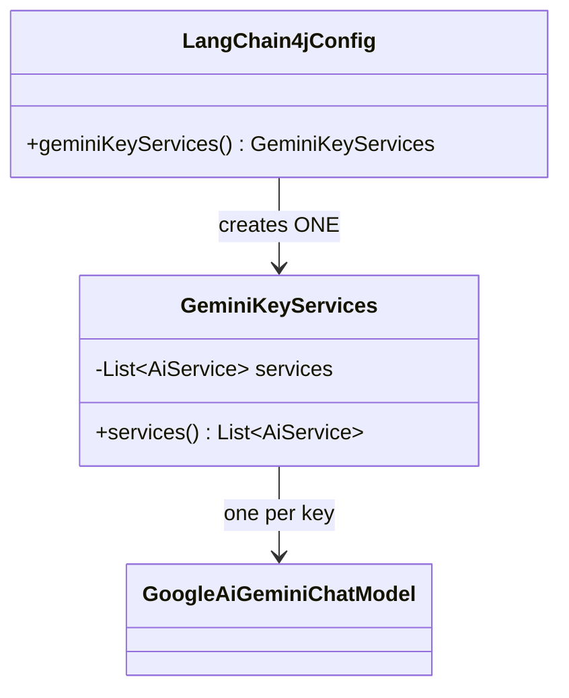

### 8.2 Factory Method
**Where:** `LangChain4jConfig.geminiKeyServices()` — a Spring `@Bean` factory method that constructs an `AiService` per API key; more broadly, Spring's IoC container instantiates and injects the correct agent for each stage.
**Need:** object creation (which model, which key, which agent) is centralised and decoupled from the code that *uses* those objects. The orchestrator never does `new RequirementAnalystAgent()` — it receives ready-made collaborators.

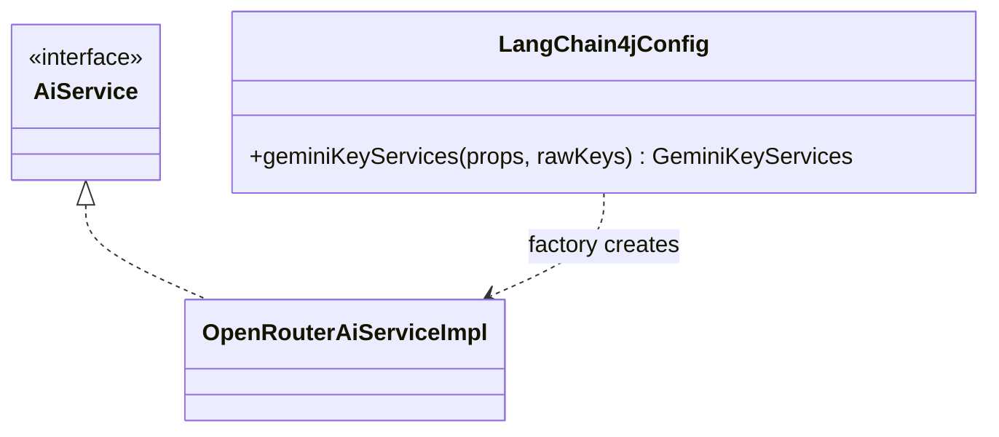

### 8.3 Builder
**Where:** `ProjectReportBuilder` (`withHeader().withRequirements()...build()`).
**Need:** the final report is assembled **incrementally** as each agent finishes, with rules (skip empty sections, never print "null"). A fluent builder makes this step-by-step assembly readable and keeps formatting logic in one place.

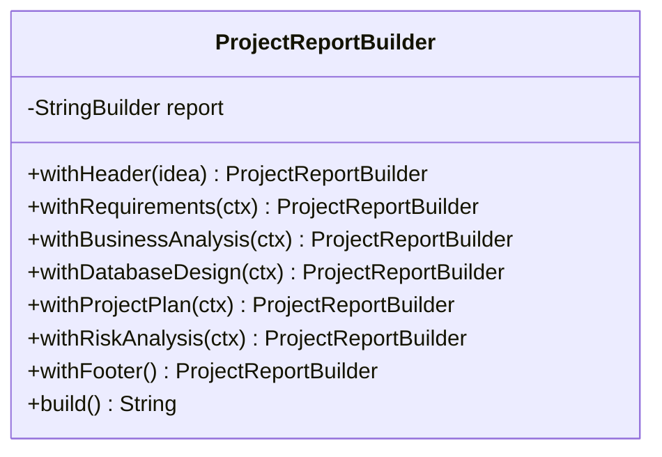

### 8.4 Chain of Responsibility
**Where:** the agent pipeline — `RequirementAnalystAgent → BusinessAnalystAgent → DatabaseArchitectAgent → ProjectPlannerAgent → RiskAnalystAgent`, each implementing `Agent<O>`.
**Need:** each stage processes the shared `ProjectState` and passes enriched context to the next. Adding/removing/reordering a stage doesn't touch the others.

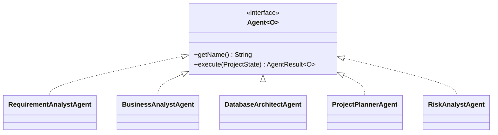

### 8.5 Mediator
**Where:** `CentralOrchestrator`.
**Need:** agents must **not** call each other directly (that would create a tangled web of dependencies). Instead every agent reports to the orchestrator, which decides what runs next, writes results back into `ProjectState`, and streams events. One brain coordinates; agents stay decoupled.

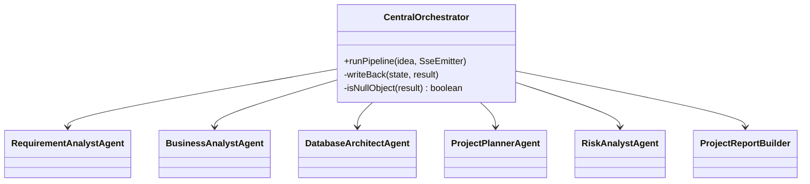

### 8.6 Observer
**Where:** `EventLogger` (subject) + `PipelineEventListener` (observers).
**Need:** progress messages ("Generating ERD…") must reach logs **and** the UI without agents knowing who is listening. Publishers fire events; any number of listeners react. A failing listener never aborts the pipeline (`CopyOnWriteArrayList`, caught exceptions).

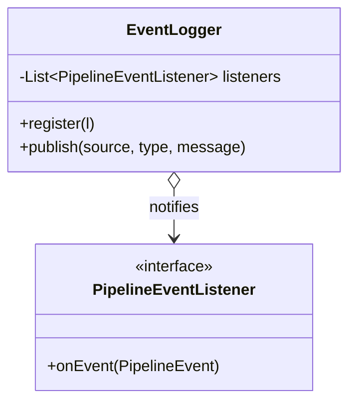

### 8.7 Adapter
**Where:** `AiService` interface + `OpenRouterAiServiceImpl` wrapping LangChain4j's `GoogleAiGeminiChatModel`; also `MarketResearchTool` wrapping Tavily.
**Need:** agents should depend on a **clean internal interface**, not on a third-party library's API. Swapping the LLM provider (OpenRouter → Gemini, as actually happened) requires only a new adapter — **zero agent code changes**.

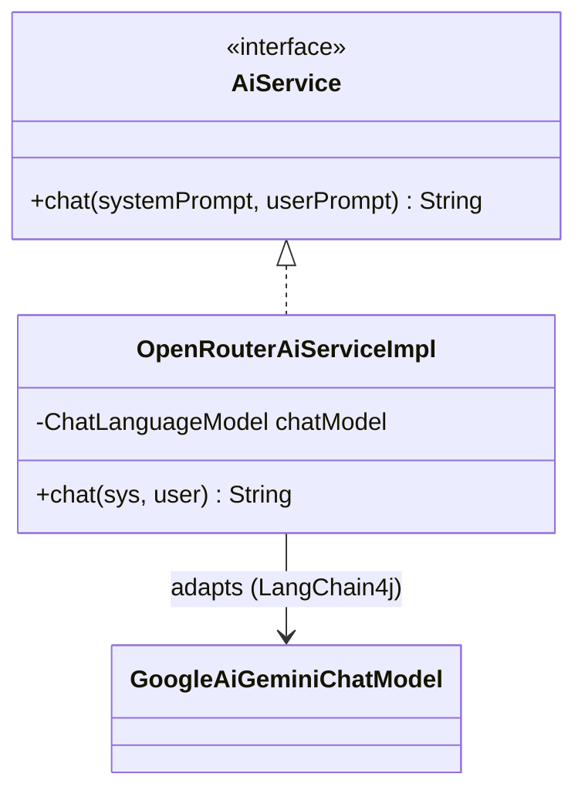

### 8.8 Bridge
**Where:** `AgentTask<T>` (abstraction) ↔ `LlmAgentTask<T>` (implementation).
**Need:** separate *what a pipeline task is* from *how it executes*. The orchestrator sequences `AgentTask`s; today they're LLM-backed (`LlmAgentTask`), but a `RuleBasedAgentTask` could be dropped in with no orchestrator change.

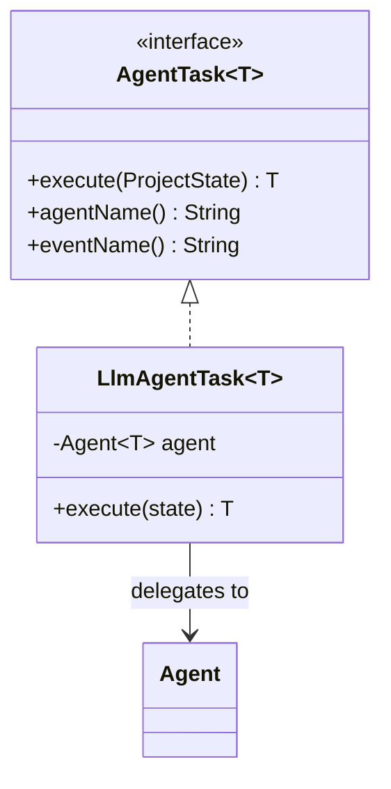

### 8.9 Composite
**Where:** `GanttContext.ProjectComponent` with `ProjectNode` (phase) and `TaskLeaf` (task).
**Need:** a project plan is a **tree** — phases contain tasks, and the report/diagram code must treat a single task and a whole phase **uniformly** (e.g. `countTasks()` recurses). Composite models that "part–whole" hierarchy cleanly.

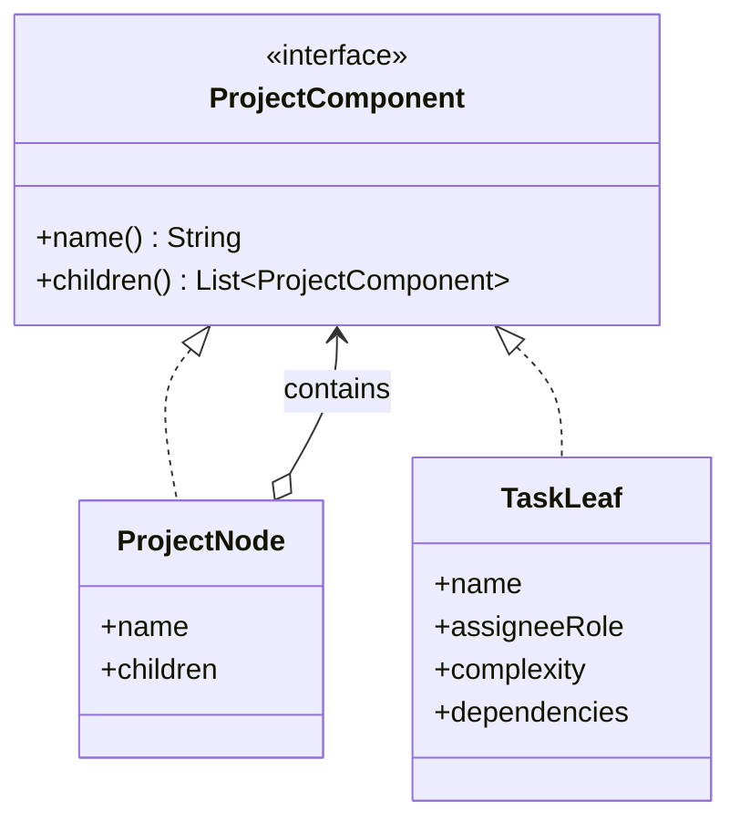

### 8.10 Null Object
**Where:** `AgentResult.failure(...)` returns an **empty context** (never `null`); `CentralOrchestrator.isNullObject()` detects it.
**Need:** when an AI call fails or returns unparseable junk, returning `null` would crash the Builder and downstream agents. Returning a safe empty object lets the pipeline detect "no useful result" and halt gracefully as `PARTIAL_COMPLETE`.

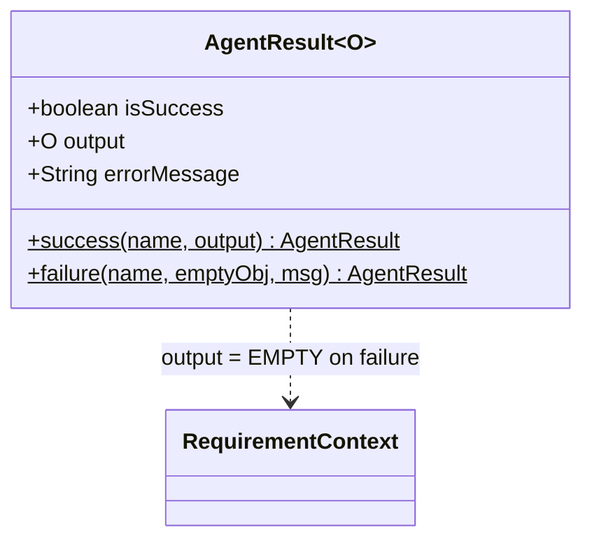

### 8.11 Decorator *(bonus — present in code)*
**Where:** `CachingAiService implements AiService`, wrapping the real `AiService`.
**Need:** add **SHA-256 response caching, token budgeting, and key rotation** *transparently* — agents still call `AiService.chat()` and get caching for free. Marked `@Primary` so it intercepts every call.

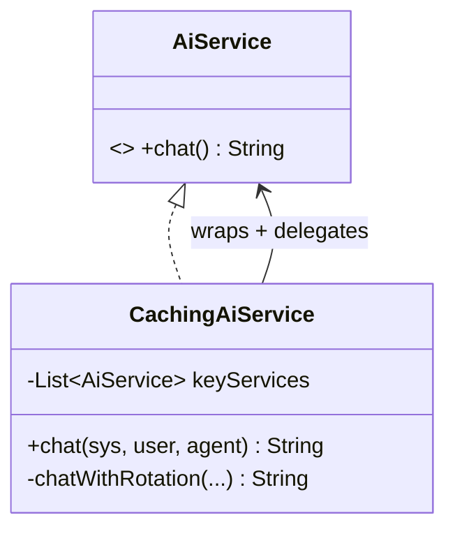

> **One-line cheat sheet for Q&A:** Singleton = one model client · Factory = Spring creates objects · Builder = report assembly · Chain = agent order · Mediator = orchestrator coordinates · Observer = live events · Adapter = clean LLM interface · Bridge = task vs execution · Composite = phase/task tree · Null Object = safe failures · Decorator = caching layer.

---

## 9. Development

**Architecture (high level):**

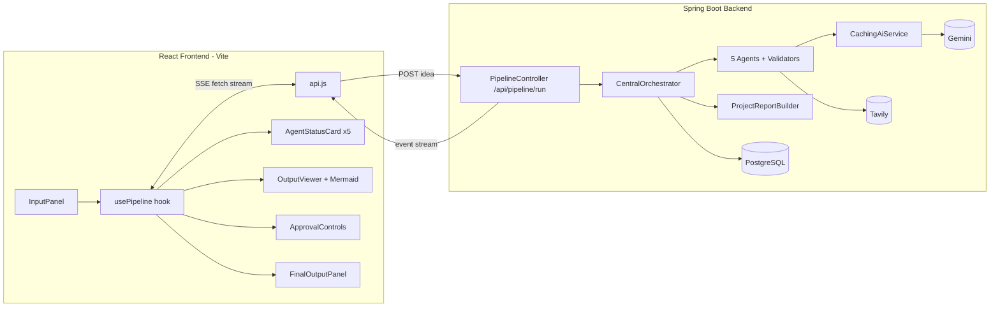

**Backend layering (package map):**
- `controller/` — REST + SSE entry (`PipelineController`).
- `core/` — `Agent`, `AgentResult`, `CentralOrchestrator` (Mediator), `ProjectReportBuilder` (Builder), `ProjectState` (+ JPA entity/repository).
- `agents/<role>/` — 5 agents, each with a paired **Validator** (structural + anti‑hallucination + cycle checks).
- `context/` — immutable output records (`RequirementContext`, `BusinessContext`, `DatabaseContext`, `GanttContext` (Composite), `RiskContext`).
- `service/` — `AiService` (Adapter), `OpenRouterAiServiceImpl`, `MarketResearchTool` (Tavily Adapter).
- `tokenmanagement/` — `CachingAiService` (Decorator), `InputStripper`, `TokenBudgetConfig`, cache entity/repo.
- `infrastructure/` — `AgentTask`/`LlmAgentTask` (Bridge), `MermaidErdGenerator`, `MermaidGanttGenerator`.
- `observer/` — `EventLogger` (Observer), `EventType`.
- `config/` — `LangChain4jConfig` (Singleton/Factory), `GeminiProperties`.

**Frontend:** a single `usePipeline` hook is the source of truth (phase: IDLE→RUNNING→COMPLETE/PARTIAL/FAILED→APPROVED). `api.js` streams SSE with native `fetch` (because `EventSource` can't POST a body), parsing `event:`/`data:` blocks and routing each to the matching agent card. Mermaid is lazy‑loaded only when an ERD/Gantt needs rendering.

**Engineering practices baked in:** secrets externalised to `.env`; pipeline never throws; failures are observable; LLM cost controlled via cache + budgets + input stripping; provider swappable behind `AiService`.

**Run commands:**
```bash
# Backend
cd autonomous-software-project-manager
set -a; source .env; set +a        # loads GEMINI_API_KEYS, TAVILY_API_KEY, DB_PASSWORD
./mvnw spring-boot:run             # http://localhost:8080
# Frontend
cd frontend && npm run dev         # http://localhost:5173
```

---

## 10. Screenshots to Attach (for the slides)

Attach these in this order — they tell the whole story:

1. **Idea input screen** (`InputPanel`) — the empty dashboard with the project‑idea textarea. *Shows the single entry point.*
2. **Pipeline mid‑run** (`AgentStatusCard` grid) — capture with some agents **Complete** ✅ and one **Running** ⏳. *Proves real‑time streaming.*
3. **Requirement Analyst output** (`OutputViewer`) — core features, user roles, completion score.
4. **Business Analyst output** — user stories + **market pain points / competitor insights** (shows live research).
5. **Database ERD** — the rendered **Mermaid entity‑relationship diagram** (the most visual slide).
6. **Project Planner** — the **Mermaid Gantt chart** + WBS tree with complexity badges.
7. **Risk Analyst output** — risk factors table with impact × probability and overall risk level chip.
8. **Approval gate** (`ApprovalControls`) — the "Approve & Finalize / Discard & Restart" buttons.
9. **Final report panel** (`FinalOutputPanel`) — assembled Markdown report with **Copy / Download** buttons.

*(Optional, for depth: a `PARTIAL_COMPLETE` state screenshot to demonstrate resilience, and the PostgreSQL `project_state` row to show persistence.)*

---

## 11. Conclusion

The Autonomous Software Project Manager shows how a **multi‑agent AI pipeline** can replace the early, labour‑intensive stages of software planning. By coordinating five role‑specialised agents through a **Mediator**, chaining their outputs, and streaming results live, it produces a coherent, evidence‑backed planning package from a one‑line idea. Just as importantly, it is **engineered, not hacked together**: ten design patterns give it clean seams, the token‑management and key‑rotation layers make it cost‑aware and rate‑limit‑resilient, and the Null‑Object/never‑throw discipline keeps it stable even when the underlying LLM misbehaves.

---

## 12. Future Expansion

- **Estimation agent:** add effort/duration/cost (currently the Planner is deliberately scope‑limited to decomposition).
- **Architecture & API‑design agents:** extend the chain with system‑design and OpenAPI generation.
- **Human‑in‑the‑loop editing:** let users edit an agent's output and re‑run only the downstream agents.
- **Export integrations:** push the WBS to Jira/Trello and the ERD to SQL DDL.
- **Persisted run history UI:** a sidebar listing past runs (the backend `GET /{id}` already supports replay).
- **Pluggable LLMs / local models:** the `AiService` adapter already makes swapping providers trivial.
- **Authentication & multi‑tenant projects:** user accounts, saved workspaces, sharing.
- **PDF/DOCX export** of the final report in addition to Markdown.
- **Streaming token-level output** within an agent (not just per-agent completion) for finer live feedback.

---

*Report generated from source on 2026-06-11. File: `PROJECT_REPORT.md`.*
